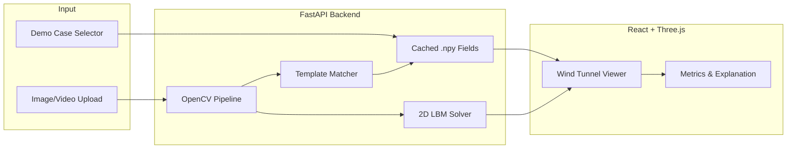

# AeroVoxel

> AeroVoxel is a browser-based virtual wind tunnel prototype that converts visual object input into interactive airflow visualization using a staged video-to-voxel simulation pipeline.

AeroVoxel is an **educational and prototype-grade** aerodynamic simulation system. The current version prioritizes interactive visualization, accessible input, and a lightweight 2D LBM solver. It should **not** be used as a certified replacement for professional CFD or wind tunnel testing.

## What Works Today

| Feature | Status |
|---|---|
| 3 demo template cases (car, drone, airfoil) | Precomputed 2D flow fields |
| Interactive wind tunnel viewer | Three.js particles + pressure coloring |
| Image/video upload | OpenCV silhouette + scale card detection |
| Live 2D simulation | D2Q9 Lattice Boltzmann on CPU |
| Offline fallback | Cached demo cases without backend |

## Quick Start

### Backend (FastAPI)

```bash
cd backend
python -m venv venv
venv\Scripts\activate        # Windows
# source venv/bin/activate   # macOS/Linux
pip install -r requirements.txt
uvicorn app.main:app --reload --host 127.0.0.1 --port 8000
```

### Frontend (React + Vite)

```bash
cd frontend
npm install
cp .env.example .env         # optional — defaults to http://127.0.0.1:8000
npm run dev
```

Open http://localhost:5173

### Regenerate cached flow fields (optional)

```bash
cd backend
venv\Scripts\activate
python -m app.services.cache_generator
```

## Architecture



### Data flow

1. **Demo path** — select a template → backend serves precomputed velocity/pressure/mask arrays (128×64 grid).
2. **Upload path** — extract keyframe → detect object contour + optional credit card scale → build 2D mask → match closest template.
3. **Solver path** — run 2D LBM on the uploaded mask with wind speed and angle → return computed flow field in the same format.

All simulation outputs share one schema: `velocity.npy` (2×ny×nx), `pressure.npy` (ny×nx), `mask.npy` (ny×nx).

## API Endpoints

| Method | Path | Description |
|---|---|---|
| GET | `/health` | Service health check |
| GET | `/api/demo-cases` | List available demo objects |
| GET | `/api/flow-field/{case_id}` | Flow field metadata + array URLs |
| POST | `/api/upload` | Upload image/video for CV processing |
| POST | `/api/simulate/simple` | Run 2D LBM on uploaded mask |

## Honesty Policy

**What is real:**
- OpenCV-based contour extraction and calibration card detection
- IoU template matching against preset silhouettes
- D2Q9 Lattice Boltzmann solver running on CPU
- Interactive particle advection from actual flow arrays

**What is approximate:**
- Drag/lift/wake metrics (heuristic estimates from flow structure)
- 3D object geometry (illustrative templates, not reconstructed meshes)
- Upload-to-template mapping before solver runs

**What is not included:**
- Full 3D CFD
- Certified engineering accuracy
- AI mesh reconstruction
- Cloud compute

## Demo Fallback Checklist

Before presenting, verify:

- [ ] Demo cases load with backend running
- [ ] App works in offline mode (cached fallback, no external images)
- [ ] Upload shows contour preview when backend is connected
- [ ] LBM solver completes for uploaded shapes
- [ ] Technical Details panel shows correct mode labels

## Project Structure

```
AeroVoxel/
├── README.md
├── backend/
│   ├── requirements.txt
│   └── app/
│       ├── main.py
│       ├── routes/          # API endpoints
│       ├── solvers/         # 2D LBM solver
│       ├── services/        # Cache generator
│       └── assets/flow/     # Precomputed .npy arrays
└── frontend/
    └── src/
        ├── App.tsx           # Dashboard UI
        ├── components/       # Viewer + landing screen
        └── utils/npyLoader.ts
```

## License

Portfolio / educational prototype.