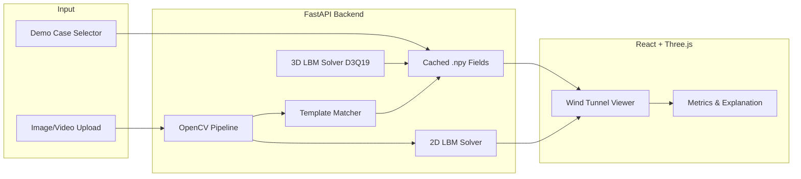

# AeroVoxel

> **Educational Virtual Wind Tunnel from Smartphone Imagery Using Lightweight Lattice Boltzmann Simulation**

AeroVoxel is a browser-based educational virtual wind tunnel. Capture or select a simple object, run a lightweight Lattice Boltzmann (LBM) airflow demo on CPU, and explore pressure, wake, and streamline behavior in the browser.

This project is **educational and prototype-grade**. It is **not** certified CFD, not a substitute for professional wind-tunnel testing, and does **not** ship AI-based 3D mesh reconstruction.

## What Works Today

| Feature | Status |
|---|---|
| Demo templates (car, drone, airfoil, **circular cylinder**) | Precomputed 2D educational LBM fields |
| Sphere 3D dataset | Optional offline D3Q19 center-slice — listed only when cache `.npy` assets exist |
| Interactive wind tunnel viewer | Three.js particles + pressure coloring |
| Image/video upload | OpenCV silhouette + optional scale-card detection |
| Live 2D simulation | D2Q9 Lattice Boltzmann on CPU |
| Offline fallback | Cached demo cases without backend |

## Quick Start

### Backend (FastAPI)

```bash
cd backend
python -m venv venv
venv\Scripts\activate        # Windows
# source venv/bin/activate   # macOS/Linux
pip install -r requirements.txt
uvicorn app.main:app --reload --host 127.0.0.1 --port 8000
```

### Frontend (React + Vite)

```bash
cd frontend
npm install
cp .env.example .env         # optional — defaults to http://127.0.0.1:8000
npm run dev
```

Open http://localhost:5173

### Regenerate cached flow fields (optional)

```bash
cd backend
venv\Scripts\activate
python -m app.services.cache_generator       # 2D demo cases (incl. cylinder_v1)
python -m app.services.cache_generator_3d     # 3D sphere cache (CPU, ~1–3 min on laptop; optional)
```

The Sphere 3D demo appears in the UI only after the 3D cache files exist under `backend/app/assets/flow/` (`sphere_3d_v1_{velocity,pressure,mask}.npy`). Without them, the API omits the case so the demo list never offers a broken load.

## Architecture


```mermaid
flowchart LR
    subgraph Input
        A[Demo Case Selector]
        B[Image/Video Upload]
    end

    subgraph Backend["FastAPI Backend"]
        C[OpenCV Pipeline]
        D[Template Matcher]
        E[2D LBM Solver]
        E2[3D LBM Solver D3Q19]
        F[Cached .npy Fields]
    end

    subgraph Frontend["React + Three.js"]
        G[Wind Tunnel Viewer]
        H[Metrics & Explanation]
    end

    A --> F
    B --> C --> D
    C --> E
    D --> F
    E --> G
    E2 --> F
    F --> G
    G --> H
```

### Data flow

1. **Demo path** — select a template → backend serves precomputed velocity/pressure/mask arrays (128×64 grid for 2D demos).
2. **Upload path** — extract keyframe → detect object contour + optional credit card scale → build 2D mask → match closest template.
3. **2D solver path** — run D2Q9 LBM on the uploaded mask with wind speed and angle → return computed flow field in the same format.
4. **3D cache path** — optional offline D3Q19 generation on a coarse 64³ grid; viewer uses a center-slice through the same 2D API.

All simulation outputs share one schema: `velocity.npy` (2×ny×nx), `pressure.npy` (ny×nx), `mask.npy` (ny×nx). 3D datasets may also store full volumetric arrays (`*_3d.npy`) for future viewer work.

## API Endpoints

| Method | Path | Description |
|---|---|---|
| GET | `/health` | Service health check |
| GET | `/api/demo-cases` | List available demo objects |
| GET | `/api/flow-field/{case_id}` | Flow field metadata + array URLs |
| POST | `/api/upload` | Upload image/video for CV processing |
| POST | `/api/simulate/simple` | Run 2D LBM on uploaded mask |

## Honesty Policy

**What is real:**
- OpenCV-based contour extraction and calibration card detection
- IoU template matching against preset silhouettes
- D2Q9 Lattice Boltzmann 2D solver running on CPU
- D3Q19 Lattice Boltzmann 3D solver running on CPU (cache generation; not a live GPU CFD path)
- Interactive particle advection from actual flow arrays
- Circular cylinder validation demo (`cylinder_v1`) as an educational bluff-body case

**What is approximate:**
- Drag/lift/wake metrics (wake heuristics and educational surface force proxies — not certified Cd/Cl)
- 3D object geometry (illustrative templates, not reconstructed meshes)
- Upload-to-template mapping before solver runs
- Coarse grids (2D 128×64; 3D 64³) suitable for teaching, not engineering sign-off
- Sphere 3D offline runs are low-Re; literature high-Re Cd values are not valid absolute comparisons

**What is not included:**
- GPU-accelerated 3D CFD (FluidX3D or similar)
- Certified engineering accuracy
- AI / neural mesh reconstruction from photos or video
- Cloud compute

## Reproducible evaluation scripts

From `backend/` (with the project virtualenv active):

```bash
python scripts/run_evaluation.py --live-2d --try-sphere-cache
python scripts/run_grid_study.py
python scripts/run_failure_tests.py
```

Optional: place real photos under `evaluation_outputs/real_phone_photos/` (gitignored) and pass `--real-photos` to the evaluation or failure scripts. Outputs write under `evaluation_outputs/` (gitignored) as JSON/CSV for local analysis.

## Demo Fallback Checklist

Before presenting, verify:

- [ ] Demo cases load with backend running (including **Circular Cylinder**)
- [ ] Sphere 3D is hidden until cache assets are present; loads after `cache_generator_3d`
- [ ] App works in offline mode (asset-backed 2D demos only; honest offline badge)
- [ ] Upload shows contour preview when backend is connected
- [ ] Live 2D LBM completes for uploaded shapes
- [ ] Technical Details panel shows honest mode labels

## Project Structure

```
AeroVoxel/
├── README.md
├── backend/
│   ├── requirements.txt
│   └── app/
│       ├── main.py
│       ├── routes/          # API endpoints
│       ├── solvers/         # 2D + 3D LBM solvers
│       │   ├── lbm_2d.py    # D2Q9 2D solver
│       │   ├── lbm_3d.py    # D3Q19 3D solver
│       │   └── fluidx3d_runner.py  # Optional FluidX3D wrapper (not required)
│       ├── services/        # Cache generators
│       └── assets/flow/     # Precomputed .npy arrays
└── frontend/
    └── src/
        ├── App.tsx           # Dashboard UI
        ├── components/       # Viewer + landing screen
        └── utils/npyLoader.ts
```

## License

Portfolio / educational prototype.
